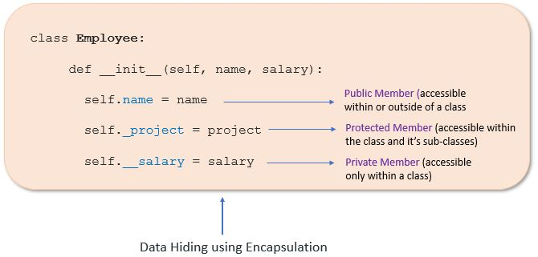

# What is Encapsulation in Python?
Encapsulation describes the concept of bundling data and methods within a single unit. i.e. when creating a *class* you are implementing *encapsulation* as all the data members (variable instances) and methods into a single unit.
* It ensures information hiding hence restricting access to variables and methods inside a class. This prevents accidental data modification.

## Access Modifiers in Python
In Python we use single *underscore* and *double underscores* as access modifiers.

### Types of Access Modifiers
https://pynative.com/wp-content/uploads/2021/08/python_data_hiding.jpg
1. *Public Member:* Accessible anywhere from outside a class.
2. *Private Member:* Acessible within the class.
3. *Protected Member:* Accessible within the class and its sub-classes.

## Advantages of Encapsulation 
* *Security:* Objects are protected from unauthorized access.
* *Data Hiding:* the user wouldn't know what is going on under the hood.
* *Simiplicity:* prevents tight coupling between classes hence simplifying maintenance
* *Aesthetics:* Makes code more readable and maintainable